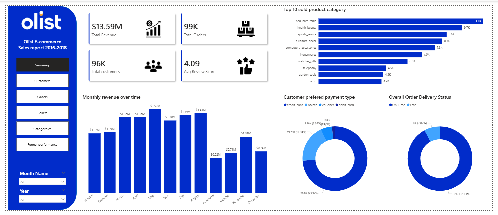

# Olist E-Commerce & Marketing Analytics

This is an end-to-end analytics project I built on top of Olist's Brazilian e-commerce dataset and its companion marketing funnel dataset. I wanted a project that went further than "load a CSV and make a chart" — something that walks through the same steps a data/analytics team actually goes through: getting the raw data in, checking it's trustworthy, modeling it properly, pulling out real insights with SQL, and finally putting it in front of a dashboard.

Olist itself is a Brazilian marketplace that sits between independent sellers and customers, similar in spirit to Amazon's marketplace model. That gave me two very different kinds of data to work with in one project — clean transactional records on one side, and messier CRM-style lead data on the other.

---

## What I was trying to answer

- How is the marketplace actually performing — orders, revenue, delivery speed?
- What do customers and sellers look like, and how do they behave?
- Which products/categories are pulling their weight, and which aren't?
- How well is the marketing funnel converting leads into active sellers?
- Are the sellers marketing brings in actually good sellers (revenue, delivery quality)?

---

## Datasets

Both datasets are public and available on Kaggle:

- **Olist Brazilian E-Commerce dataset** — orders, customers, sellers, products, payments, reviews.
  https://www.kaggle.com/datasets/olistbr/brazilian-ecommerce
- **Olist Marketing Funnel dataset** — marketing-qualified leads (MQLs) and the deals that closed from them.
  https://www.kaggle.com/datasets/olistbr/marketing-funnel-olist

More detail on both, including field-level notes, is in `02_data_sources/`.

I deliberately kept these two as separate domains throughout the project rather than forcing them into one schema — they come from different systems in real life (an e-commerce backend vs. a CRM), and treating them that way felt more honest than pretending they're one dataset.

---

## How the repo is laid out

I organized this folder-by-folder to mirror the actual order I worked in, from raw data to finished dashboard:

| Folder | What's in it |
|---|---|
| `01_project_overview` | Why this project exists and what I was trying to learn/answer |
| `02_data_sources` | Where the data came from and what each source contains |
| `03_ddl_table_creation` | The table definitions (schema) for both domains |
| `04_dml_data_load` | How the raw CSVs get loaded in, including the staging approach for the messier marketing data |
| `05_data_validation` | Quality checks I ran before trusting any of this for analysis |
| `06_star_schema` | The data model I designed for each domain (and why they're modeled differently) |
| `07_Analytical_insights` | The actual SQL analysis — this is where the business questions get answered |
| `08_power_bi_dashboard` | The Power BI dashboards built on top of everything above |

Each stage builds on the one before it, so if something in the insights doesn't make sense, the answer is usually a couple of folders back.

---

## Modeling choices

**E-commerce side — star schema.** The transactional data (orders, items, payments, reviews, etc.) is a textbook case for a star schema, with `Fact_Order_Items` at the center and dimensions for customers, products, sellers, orders, payments, reviews, geolocation, and category translation. Item-level grain made the most sense since a single order can contain several products, each with its own price, seller, and freight cost. Details and the full field list are in `06_star_schema/ecommerce/`.

**Marketing side — funnel model, not a star schema.** I went back and forth on this one, but ultimately decided a star schema didn't fit. The marketing funnel data is just two event-level tables (`marketing_qualified_leads` and `marketing_closed_deals`) linked by `mql_id` — there's no repeating transactional grain to build a fact table around. Forcing it into a star schema would have added complexity without adding clarity, so I modeled it as a simple funnel instead: leads in at the top, closed deals at the bottom, conversion measured through the join between them. Write-up is in `06_star_schema/marketing/`.

Deciding *not* to use a star schema here was as much a modeling decision as designing one for the e-commerce side — I wanted the repo to show that reasoning, not just the diagram.

---

## The analysis

All of the business questions are answered directly in SQL, organized by theme:

**E-commerce (`07_Analytical_insights/ecommerce/`)**
- Customer distribution, repeat purchase rate, customer lifetime value
- Delivery performance — actual vs. estimated, by seller, by state, by category
- Product/category performance — units sold, revenue, pricing, profitability
- Payment behavior — installments, payment type revenue split
- Reviews — score distribution, link between late delivery and rating, seller ranking

**Marketing (`07_Analytical_insights/marketing/`)**
- Overall MQL → closed deal conversion rate
- Conversion rate by lead origin
- Revenue by seller business type
- Whether having a registered company correlates with higher revenue
- Regional revenue differences
- Whether acquisition quality shows up later in delivery performance (tying the two datasets together)

---

## Dashboards

Both domains get their own Power BI dashboard, built on the validated, modeled tables above.

**E-commerce dashboard** — 5 pages covering customers, orders, sellers, products, and categories.

More screenshots: `08_power_bi_dashboard/screenshots/ecommerce/`

**Marketing funnel dashboard** — tracks the funnel from MQL to closed deal, conversion by lead origin, and revenue quality of the sellers acquired.

Screenshot: `08_power_bi_dashboard/screenshots/marketing/`

The `.pbix` file itself is too large for GitHub, so it's hosted externally — the link is in `08_power_bi_dashboard/`.

---

## Tools

SQL (PostgreSQL) · data modeling (star schema + funnel modeling) · data validation · Power BI Desktop · DAX

---

## Notes to myself (and anyone reading this)

This project was as much about practicing *judgment* as it was about writing SQL — deciding when a star schema is worth the overhead and when it isn't, deciding how much to validate before trusting a dataset, deciding what actually counts as an "insight" versus just a query. I'd rather this repo show that thinking than just show finished charts.
